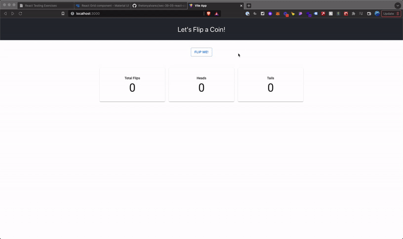

# Coin Flip App

This is a simple Coin Flip app that tracks how many heads and tails you flip.
This is built using React.

- [App Demo](#app-demo)
- [Installation and Setup](#installation-and-setup)
- [Testing](#testing)
## App Demo



To use the app, simply click on the "Flip Me!" button.

## Installation and Setup
To install the app and start up the server, run:
```shell
npm install
npm run dev
```

Then visit [http://localhost:3000](http://localhost:3000) to preview the app in your browser.

## Testing
To run tests, run:
```shell
npm test
```

This will run smoke and snapshot tests for each component.